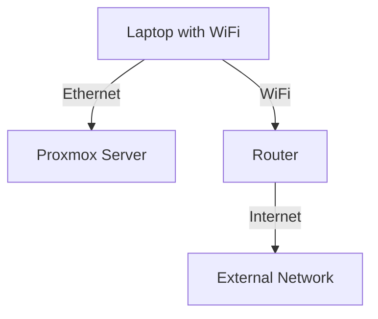
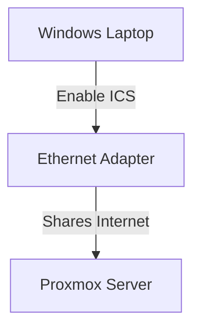
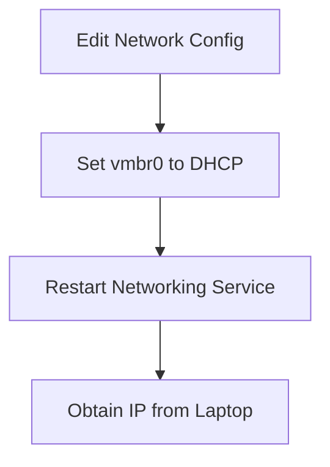
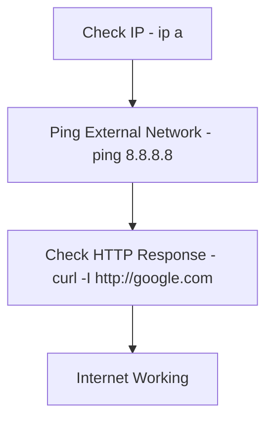
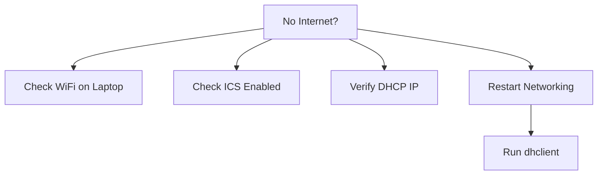

# **Connecting Proxmox to the Internet via a Secondary Laptop (WiFi Bridge)**

## **Overview**
This guide explains how to connect a **Proxmox server** to the internet using a **secondary laptop as a WiFi bridge**. This setup is useful when your Proxmox server is **not located near your main router** and a direct Ethernet connection isn't possible.

---

## **🛠 Prerequisites**
- **Proxmox installed** and running on your server
- **Secondary device** (e.g., a laptop with Windows 10/11) connected to a WiFi network
- **Ethernet cable** to connect the **secondary device** to the **Proxmox server**



---

## **1️⃣ Step 1: Configure Internet Connection Sharing on Windows**
1. On your **secondary laptop**, open **Control Panel > Network and Sharing Center**.
2. Click **Change adapter settings** on the left side.
3. Right-click your **WiFi adapter** and choose **Properties**.
4. Go to the **Sharing** tab.
5. Check **Allow other network users to connect through this computer's internet connection**.
6. Under **Home networking connection**, select the **Ethernet adapter** connected to your **Proxmox server**.
7. Click **OK**.



---

## **2️⃣ Step 2: Set the Proxmox Network Interface to DHCP**
8. On your **Proxmox server**, edit the **network configuration file**:

```bash
nano /etc/network/interfaces
```

9. Ensure your `vmbr0` (bridge interface) is set to **DHCP**:

```ini
auto vmbr0
iface vmbr0 inet dhcp
    bridge_ports eth0
    bridge_stp off
    bridge_fd 0
```

10. Save and exit the editor.

11. Restart networking:

```bash
systemctl restart networking
```



---

## **3️⃣ Step 3: Verify the Connection**
12. **Check your IP configuration**:

```bash
ip a
```

Ensure you have an IP address in the range of `192.168.x.x` (or based on your **WiFi network**).

13. **Test connectivity**:

```bash
ping 8.8.8.8
```

If successful, you should receive replies. Otherwise, troubleshoot the **network configuration**.

14. **Use `curl` to confirm internet access**:

```bash
curl -I http://google.com
```

You should see an HTTP `301` or `200` response.



---

## **🛠 Troubleshooting**
If the **Proxmox server still has no internet access**, try the following:

- **Ensure your secondary device's WiFi connection is stable.**
- **Verify that Internet Connection Sharing (ICS) is enabled.**
- **Check `/etc/resolv.conf` on Proxmox** for a valid **nameserver** (`8.8.8.8` or `1.1.1.1`).
- **Restart networking if changes are made**:

```bash
dhclient -r vmbr0
dhclient vmbr0
```



---

## **🎯 Conclusion**
By following this guide, you can **bridge your WiFi connection** to provide **internet access** to your **Proxmox server** without needing a **direct Ethernet connection** to your router.

---

🚀 **Would love your feedback!**
If this guide helped you, consider **starring the repo ⭐** or suggesting improvements!
