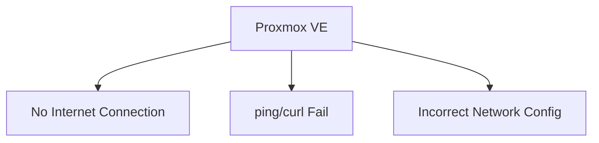
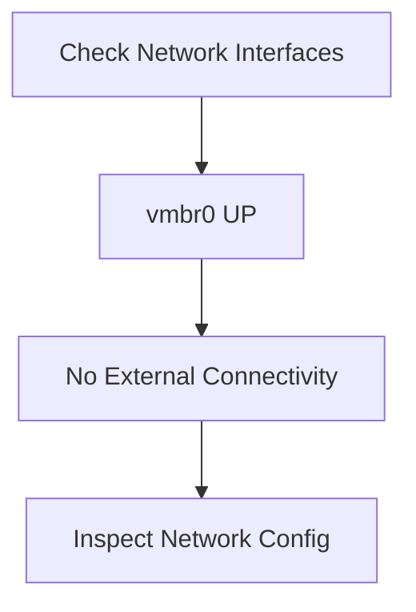
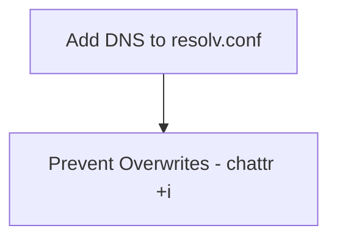
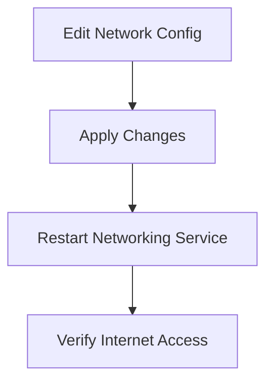
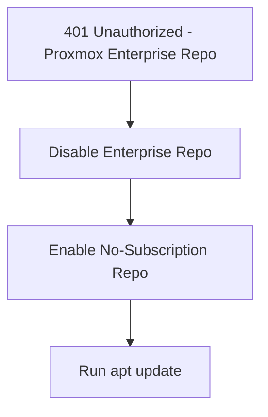
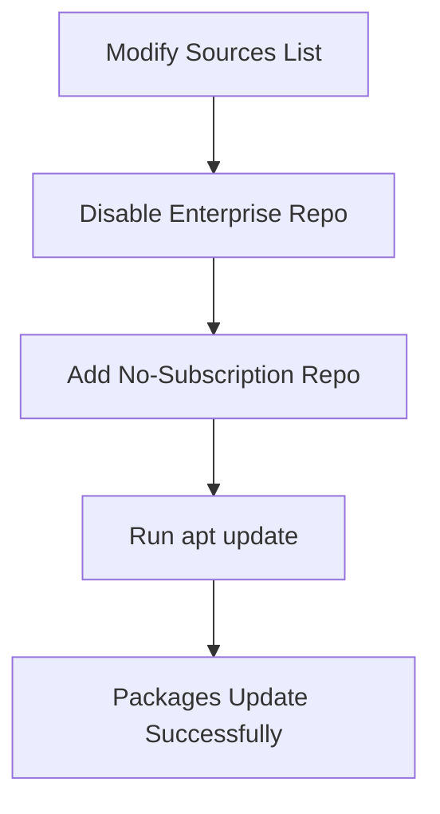
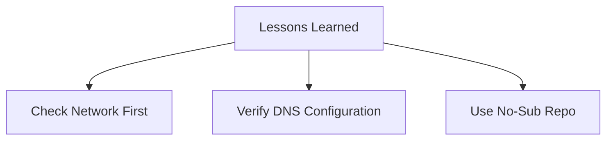

# **Proxmox Network Troubleshooting Guide**

## **Overview**
Recently, I encountered several network-related issues while working with my **Proxmox Virtual Environment (VE)** and **Debian VMs**. This article details how I identified and resolved these problems, including fixing `apt update` errors caused by incorrect network configurations and Proxmox Enterprise repository warnings.

---

## **1️⃣ Problem Diagnosis**

### **🛑 Initial Symptoms**
1. Unable to connect to the internet inside my Proxmox VE environment.
2. `ping` and `curl` commands to external sites failed with network unreachable errors.
3. Network configuration seemed incorrect on both the Proxmox host and Debian VM.



### **📜 Key Error Logs**
```bash
ping: connect: Network is unreachable
```
```bash
apt update Err: https://enterprise.proxmox.com bookworm InRelease 401 Unauthorized [IP: xx.xx.xx.xx]
```

---

## **2️⃣ Step-by-Step Troubleshooting**

### **🔍 Step 1: Verifying Network Interfaces**
I used `ip a` to check the status of my network interfaces. It was evident that the `vmbr0` bridge was up and assigned an IP address, but there was no connection to external networks.

```bash
ip a
```



---

### **🔧 Step 2: Checking `/etc/network/interfaces` Configuration**
The configuration file showed that `vmbr0` was correctly set up for DHCP, but no external DNS servers were added.

```bash
nano /etc/network/interfaces
```

📝 **Configuration File:**
```ini
auto lo
iface lo inet loopback  

auto enp0s31f6
iface enp0s31f6 inet manual  

auto vmbr0
iface vmbr0 inet dhcp
    bridge_ports enp0s31f6
    bridge_stp off
    bridge_fd 0
```

---

### **🌐 Step 3: Adding DNS Servers**
To ensure proper DNS resolution, I edited `/etc/resolv.conf` to include external DNS servers.

```bash
nano /etc/resolv.conf
```

Added:
```ini
nameserver 8.8.8.8
nameserver 1.1.1.1
```

To prevent overwriting:
```bash
chattr +i /etc/resolv.conf
```



---

### **♻️ Step 4: Restarting Network Services**
To apply the changes:

```bash
systemctl restart networking
```



---

## **3️⃣ Resolving Proxmox Repository Errors**

### **🔑 401 Unauthorized Error**
During `apt update`, I encountered a **401 error** for the **Proxmox Enterprise repository**. Since I wasn’t using a subscription, I had to **disable this repository** and enable the **no-subscription repository**.



### **❌ Disabling Proxmox Enterprise Repository**
```bash
nano /etc/apt/sources.list.d/pve-enterprise.list
```

Comment out this line:
```ini
# deb https://enterprise.proxmox.com/debian/pve bookworm pve-enterprise
```

### **✅ Adding the No-Subscription Repository**
Edit `/etc/apt/sources.list`:
```bash
nano /etc/apt/sources.list
```

Add:
```ini
deb http://download.proxmox.com/debian/pve bookworm pve-no-subscription
```

---

### **🔄 Updating Package List**
```bash
apt update
```



---

## **4️⃣ Lessons Learned**
1. **Network Troubleshooting**: Always check interface configurations and DNS settings when dealing with network issues.
2. **Proxmox Repository Management**: If you’re using Proxmox without a subscription, ensure you switch to the **community repository** to avoid errors.
3. **Persistence**: Solving these issues required a **methodical approach**—small changes, testing, and iteration.



---

## **🎯 Conclusion**
Through persistent troubleshooting, I was able to **restore full network connectivity** and **fix repository errors**. This experience reinforced the importance of **understanding network configurations** and **repository management** in Proxmox VE and Debian environments.

---

🚀 **Would love your feedback!**
If this guide helped you, consider **starring the repo ⭐** or suggesting improvements!
