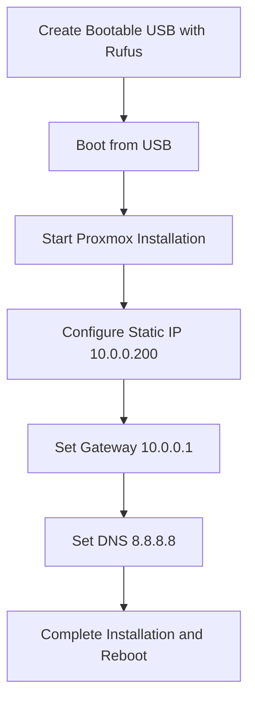
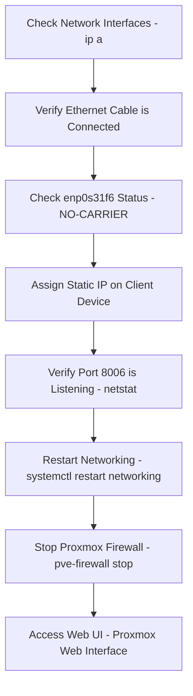
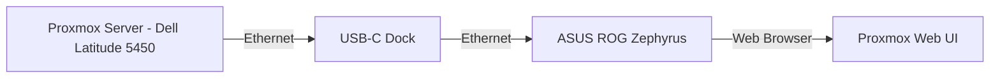
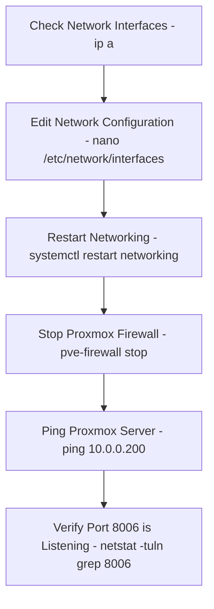
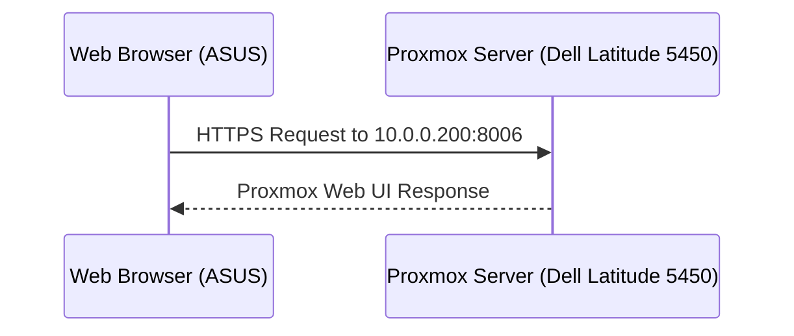

# Proxmox Setup on Dell Latitude 5450

## Overview
This guide documents the installation process and troubleshooting steps for setting up Proxmox VE on a Dell Latitude 5450. The project involved configuring a custom network and resolving multiple connectivity issues to successfully access the Proxmox web interface.

---

## 🖥️ Installation Process

### 1️⃣ Creating a Bootable USB
I used Rufus to flash the Proxmox ISO onto a USB drive with the following settings:
- **Partition Scheme:** MBR
- **Target System:** BIOS or UEFI
- **File System:** FAT32

After flashing, the USB was detected, and I booted into Proxmox on the Dell Latitude 5450.



### 2️⃣ Proxmox Installation
I configured static network settings during installation:
- **Static IP:** 10.0.0.200/24
- **Gateway:** 10.0.0.1
- **DNS Server:** 8.8.8.8

After installation, the system rebooted successfully.

---

## 🔧 Troubleshooting Process

### 3️⃣ Network Configuration Issues
After reboot, I could not access the Proxmox web interface at `https://10.0.0.200:8006`. I followed these troubleshooting steps:



### 4️⃣ Network Setup (Dell Latitude 5450 + ASUS via Dock)
Since my ASUS ROG Zephyrus doesn’t have an Ethernet port, I used a USB-C Dock to connect it directly to Proxmox.



### 5️⃣ Editing Network Configuration
To manually configure Proxmox networking, I updated the network configuration file:

```bash
nano /etc/network/interfaces
```

📝 **Updated Configuration:**
```ini
auto lo
iface lo inet loopback

auto enp0s31f6
iface enp0s31f6 inet static
    address 10.0.0.200/24
    gateway 10.0.0.1
    dns-nameservers 8.8.8.8
```

Restart networking after changes:

```bash
systemctl restart networking
```

---

## 6️⃣ Key Commands for Troubleshooting



---

## 📌 Summary of Commands:

| Command                            | Description                              |
|------------------------------------|------------------------------------------|
| `ip a`                             | Check network interfaces                 |
| `nano /etc/network/interfaces`     | Edit network configuration               |
| `systemctl restart networking`     | Restart networking service               |
| `systemctl status pveproxy`        | Check Proxmox proxy service status       |
| `pve-firewall stop`                | Stop Proxmox firewall                    |
| `ping 10.0.0.1`                    | Ping gateway                             |
| `ping 10.0.0.200`                  | Ping Proxmox server                      |
| `netstat -tuln | grep 8006`        | Check if Port 8006 is listening          |

---

## 7️⃣ Network Traffic Flow (Proxmox Web UI)



---

## 🎯 Conclusion
This guide serves as a reference for future Proxmox VE installations and network troubleshooting. The **Mermaid.js diagrams** help visualize the installation, troubleshooting, and network processes.

✅ **Next Steps:**
- 👉 Deploy virtual machines for cybersecurity lab simulations.
- 👉 Configure VLANs and multiple bridges for isolated networks.
- 👉 Set up automated backups and monitoring.

🚀 **Would love your feedback!**
If this guide helped you, consider **starring the repo ⭐** or suggesting improvements!
