# Proxmox Setup on Dell Latitude 5450

## Overview
This guide documents the installation process and troubleshooting steps for setting up Proxmox VE on a Dell Latitude 5450. This project involved configuring a custom network and resolving multiple connectivity issues to successfully access the Proxmox web interface.

## Installation Process

### 1️⃣ Creating a Bootable USB
I used **Rufus** to flash the Proxmox ISO onto a USB drive with the following settings:
- **Partition Scheme**: MBR
- **Target System**: BIOS or UEFI
- **File System**: FAT32

After flashing, the USB was detected, and I booted into Proxmox on the Dell Latitude 5450.

### 2️⃣ Proxmox Installation
- **Static IP**: `10.0.0.200/24`
- **Gateway**: `10.0.0.1`
- **DNS Server**: `8.8.8.8`

After installation, the system rebooted successfully.

```mermaid
graph TD;
    A[Download Proxmox ISO] --> B[Create Bootable USB with Rufus];
    B --> C[Boot into Dell Latitude 5450];
    C --> D[Set Static IP: 10.0.0.200/24];
    D --> E[Set Gateway: 10.0.0.1];
    E --> F[Set DNS: 8.8.8.8];
    F --> G[Complete Installation & Reboot];
    G --> H[Proxmox Installed Successfully ✅];
```



---

## Troubleshooting Process

### 3️⃣ Network Configuration Issues
After reboot, I couldn’t access the Proxmox web interface at `https://10.0.0.200:8006`. I followed these troubleshooting steps:


### 4️⃣ Network Setup (Dell Latitude 5450 + ASUS via Dock)


---

## Proxmox Network Configuration

### 5️⃣ Editing Network Configuration (/etc/network/interfaces)


```bash
nano /etc/network/interfaces

# Updated Configuration
auto lo
iface lo inet loopback

auto enp0s31f6
iface enp0s31f6 inet static
    address 10.0.0.200/24
    gateway 10.0.0.1
    dns-nameservers 8.8.8.8
```

Restart networking after changes:
```bash
systemctl restart networking
```

---

### 6️⃣ Key Commands for Troubleshooting

```mermaid
graph TD;
    A[ip a] --> B[Check Network Interfaces];
    B --> C[nano /etc/network/interfaces];
    C --> D[Edit Network Configuration];
    D --> E[systemctl restart networking];
    E --> F[Restart Networking Service];
    F --> G[pve-firewall stop];
    G --> H[Disable Firewall];
    H --> I[ping 10.0.0.200];
    I --> J[Confirm Proxmox Server is Reachable];
    J --> K[netstat -tuln | grep 8006];
    K --> L[Check if Proxmox Web UI is Listening];
```

**Summary of Commands:**
```bash
ip a                                # Check network interfaces
nano /etc/network/interfaces        # Edit network configuration
systemctl restart networking        # Restart networking service
systemctl status pveproxy           # Check Proxmox proxy service status
pve-firewall stop                   # Stop Proxmox firewall
ping 10.0.0.1                       # Ping gateway
ping 10.0.0.200                     # Ping Proxmox server
netstat -tuln | grep 8006           # Check if Port 8006 is listening
```

---

### 7️⃣ Network Traffic Flow (Proxmox Web UI)


---

## Conclusion
This guide serves as a reference for future **Proxmox VE** installations and **network troubleshooting**. The **Mermaid.js diagrams** help **visualize** the installation, troubleshooting, and network processes.

✅ **Next Steps:**
- Deploy virtual machines for **cybersecurity lab simulations**.
- Configure **VLANs and multiple bridges** for isolated networks.
- Set up **automated backups and monitoring**.

### 🎯 **Would love your feedback!**
If this guide helped you, consider **starring the repo** ⭐ or suggesting improvements!

---
