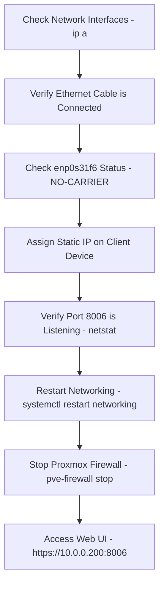
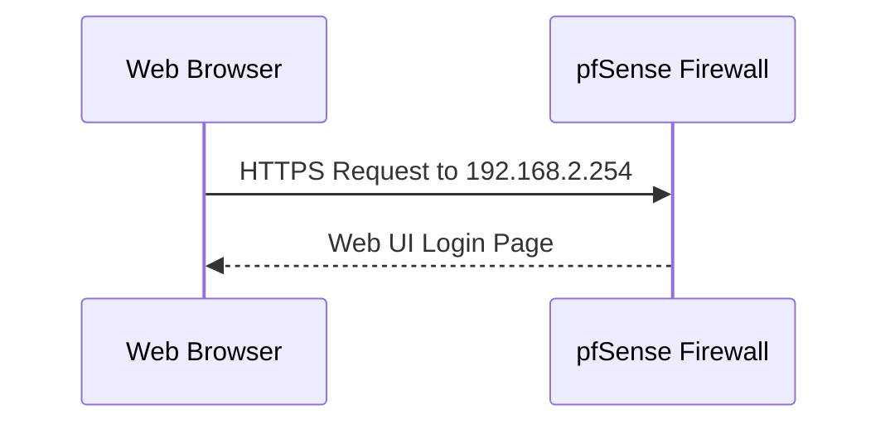

# Proxmox, pfSense, and WireGuard VPN Setup

## Overview
This guide explains the setup process for **Proxmox**, **pfSense**, and **WireGuard VPN** to enhance security and remote access to your home lab environment.

---

## 🖥️ Proxmox Installation

### 1️⃣ Creating a Bootable USB
I used **Rufus** to flash the Proxmox ISO onto a USB drive with the following settings:
- **Partition Scheme:** MBR
- **Target System:** BIOS or UEFI
- **File System:** FAT32

After flashing, the USB was detected, and I booted into **Proxmox** on the **Dell Latitude 5450**.

```mermaid
graph TD;
    A[Create Bootable USB with Rufus] -->|Boot from USB| B[Start Proxmox Installation];
    B --> C[Configure Static IP (10.0.0.200)];
    C --> D[Set Gateway (10.0.0.1)];
    D --> E[Set DNS (8.8.8.8)];
    E --> F[Complete Installation and Reboot];
```

### 2️⃣ Proxmox Installation
I configured static network settings during installation:
- **Static IP:** 10.0.0.200/24
- **Gateway:** 10.0.0.1
- **DNS Server:** 8.8.8.8

After installation, the system rebooted successfully.

---

## 🔧 Troubleshooting Network Issues

### 3️⃣ Diagnosing Network Problems
After reboot, I could not access the **Proxmox Web UI** at `https://10.0.0.200:8006`. 



### 4️⃣ Network Setup (Laptop as a WiFi Bridge)
Since my **Proxmox server** wasn't near a router, I used a **Windows 10 laptop** as a WiFi bridge.

```mermaid
graph LR;
    A[Proxmox Server] --Ethernet--> B[Laptop (WiFi Bridge)];
    B --WiFi--> C[Home Router];
    C --Internet--> D[External Network];
```

### 5️⃣ Editing Proxmox Network Configuration

```bash
nano /etc/network/interfaces
```

📝 **Updated Configuration:**

```ini
auto lo
iface lo inet loopback

auto enp0s31f6
iface enp0s31f6 inet static
    address 10.0.0.200/24
    gateway 10.0.0.1
    dns-nameservers 8.8.8.8
```

Restart networking after changes:

```bash
systemctl restart networking
```

---

## 🌐 pfSense Installation

### 6️⃣ Setting up pfSense in Proxmox
1. Create a **VM** for pfSense in **Proxmox**
   - **CPU**: 2 cores
   - **RAM**: 2GB
   - **Disk**: 16GB
   - **WAN Interface**: vmbr0
   - **LAN Interface**: vmbr1

2. Boot using **pfSense ISO** and complete the setup.
3. Assign **WAN** and **LAN** interfaces:
   - **WAN** (`vtnet0`): `192.168.137.x`
   - **LAN** (`vtnet1`): `192.168.2.x`

4. Configure LAN:
   - **Static IP**: `192.168.2.254/24`
   - **DHCP Range**: `192.168.2.100 - 192.168.2.200`



---

## 🔐 WireGuard VPN Setup

### 7️⃣ Installing WireGuard on pfSense
1. Navigate to **System > Package Manager** and install **WireGuard**.
2. Go to **VPN > WireGuard > Tunnels** and click **Add Tunnel**.
   - **Tunnel Address**: `10.10.50.1/24`
   - **Listen Port**: `51820`

3. Add a peer for **ASUS laptop**:
   - **Allowed IPs**: `10.10.50.2/32`

### 8️⃣ Creating Firewall Rules
1. Go to **Firewall > Rules > WireGuard**.
2. Allow all traffic:
   - **Source:** WireGuard net
   - **Destination:** Any

```mermaid
graph TD;
    A[Firewall Rules] -->|Allow| B[WireGuard Net];
    B -->|Permit Traffic| C[pfSense LAN (10.10.1.0/24)];
```

### 9️⃣ Configuring WireGuard on ASUS Laptop
Create a configuration file:

```ini
[Interface]
PrivateKey = <Your_Laptop_Private_Key>
Address = 10.10.50.2/24
DNS = 8.8.8.8, 8.8.4.4

[Peer]
PublicKey = <WireGuard_Server_Public_Key>
AllowedIPs = 10.10.50.0/24
Endpoint = <Your_Public_IP>:51820
PersistentKeepalive = 25
```

Start the VPN tunnel in WireGuard and connect.

### 🔗 Accessing Proxmox Securely
Navigate to:

```bash
https://10.10.1.100:8006
```

or using DNS:

```bash
https://proxmox.home.arpa:8006
```

---

## 🎯 Conclusion
This guide provides a **secure** and **efficient** way to:
- Install **Proxmox** and troubleshoot networking issues.
- Configure **pfSense** as a firewall for your home lab.
- Set up **WireGuard VPN** for remote access to **Proxmox**.

🚀 **Next Steps:**
- Deploy VLANs for better network segmentation.
- Automate firewall rules with Ansible.
- Implement **OpenVPN** as an alternative.

📌 **Like this guide? Star the repo ⭐ and contribute!**
