# **Secure Remote Access to Proxmox via WireGuard VPN on pfSense**

## **Overview**
This guide walks through setting up a **WireGuard VPN** on **pfSense** to enable **secure remote access** to your **Proxmox server** from anywhere.

---

## **🔹 Why Use WireGuard VPN?**
WireGuard is a **fast and modern VPN** protocol with:
- **High-speed performance**
- **Strong encryption**
- **Simple configuration**
- **Low resource usage**

By integrating WireGuard into **pfSense**, you can securely access your internal network from anywhere.


---

## **🔹 Network Setup Overview**
| Component  | IP Address / Network |
|------------|----------------------|
| **pfSense Internal Network** | `10.10.1.0/24` |
| **WireGuard Tunnel Network** | `10.10.50.0/24` |
| **Proxmox Server IP** | `10.10.1.100` |
| **WireGuard Port** | `51820` |

The goal is to connect your **ASUS laptop** to this VPN and access **Proxmox securely** through its **internal IP**.

---

## **1️⃣ Step 1: Set Up WireGuard on pfSense**
### **📌 Install WireGuard**
1. Navigate to **System > Package Manager** on pfSense.
2. Install the **WireGuard** package.

### **📌 Configure the WireGuard Tunnel**
1. Go to **VPN > WireGuard > Tunnels** and click **Add Tunnel**.
2. Configure:
   - **Description:** `RemoteAccessVPN`
   - **Listen Port:** `51820`
   - **Tunnel Address:** `10.10.50.1/24`
3. Click **Save** and **Apply Changes**.

### **📌 Add a Peer for Your Laptop**
1. Go to **VPN > WireGuard > Peers** and click **Add Peer**.
2. Configure:
   - **Description:** `asus-laptop`
   - **Dynamic Endpoint:** Checked
   - **Allowed IPs:** `10.10.50.2/32`
   - **Pre-shared Key:** *(Optional, but recommended)*
3. Click **Save** and **Apply Changes**.


### **📌 Create Firewall Rules**
1. Navigate to **Firewall > Rules > WireGuard**.
2. Add a rule to allow all traffic:
   - **Action:** Pass
   - **Protocol:** Any
   - **Source:** WireGuard net
   - **Destination:** Any
3. Save and apply changes.

```mermaid
graph TD;
    A[Firewall Rules] -->|Allow| B[WireGuard Net];
    B -->|Permit Traffic| C[pfSense LAN (10.10.1.0/24)];
```

---

## **2️⃣ Step 2: Configure WireGuard on Your ASUS Laptop**
### **📌 Install WireGuard Client**
- Download and install the **WireGuard client** from the [official WireGuard website](https://www.wireguard.com/install/).

### **📌 Create a Configuration File**
1. Open **WireGuard** and click **Add Tunnel > Add Empty Tunnel**.
2. Enter the following configuration:

```ini
[Interface]
PrivateKey = <Your Laptop Private Key>
Address = 10.10.50.2/24
DNS = 8.8.8.8, 8.8.4.4

[Peer]
PublicKey = <WireGuard Server Public Key>
AllowedIPs = 10.10.50.0/24
Endpoint = <Your Public IP>:51820
PersistentKeepalive = 25
```
3. Save the configuration as `asus-laptop.conf`.

### **📌 Activate the VPN**
- In **WireGuard client**, select the `asus-laptop.conf` tunnel and click **Activate**.


---

## **3️⃣ Step 3: Access Your Proxmox Server Remotely**
### **📌 Connect to the VPN**
1. Ensure **WireGuard** is **active** on your **ASUS laptop**.

### **📌 Access Proxmox**
1. Open a web browser and go to:
   ```bash
   https://10.10.1.100:8006
   ```
2. You should now have full access to your **Proxmox Web Interface**.

```mermaid
sequenceDiagram
    participant Laptop as ASUS Laptop
    participant WireGuard as WireGuard VPN
    participant Proxmox as Proxmox Server

    Laptop->>WireGuard: VPN Connection (10.10.50.2 → 10.10.50.1)
    WireGuard->>Proxmox: Request Access (10.10.1.100:8006)
    Proxmox-->>Laptop: Web Interface Loaded
```



---

## **🔹 Optional: Setting Up DNS for Easy Access**
To avoid remembering IP addresses, set up **local DNS** in **pfSense**:

1. Navigate to **Services > DNS Resolver**.
2. Add a **host override**:
   - **Hostname:** `proxmox`
   - **Domain:** `home.arpa`
   - **IP Address:** `10.10.1.100`
3. Save and apply changes.

Now, you can access Proxmox by typing:
```bash
https://proxmox.home.arpa:8006
```
instead of `https://10.10.1.100:8006`.


---

## **🎯 Conclusion**
With **WireGuard VPN** configured on **pfSense**, you can **securely manage your Proxmox server from anywhere**. This setup enhances **security** while ensuring **remote access** to your home lab.

---

🚀 **Would love your feedback!**
If this guide helped you, consider **starring the repo ⭐** or suggesting improvements!
