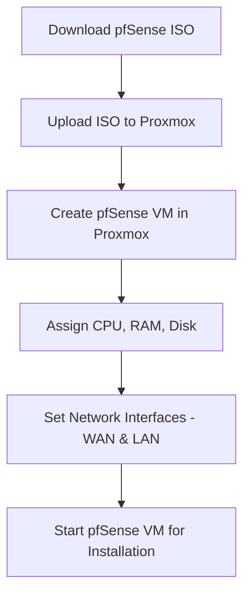
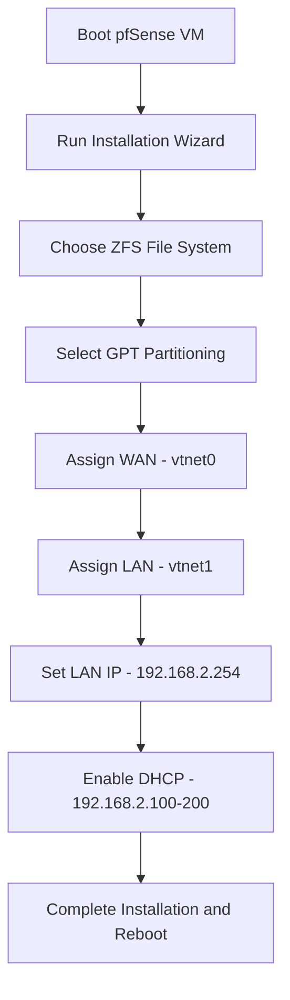
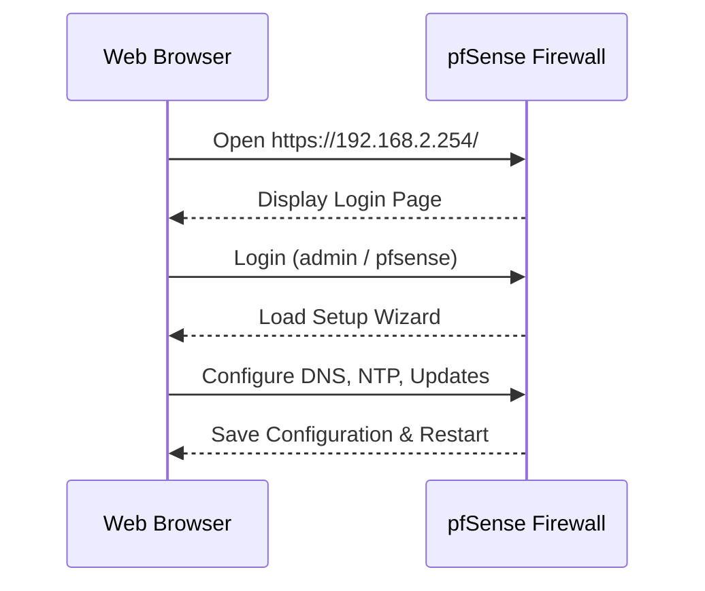
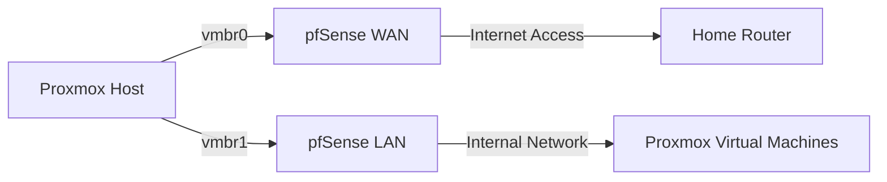
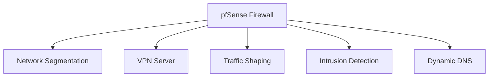

# pfSense Setup in Proxmox

## **Overview**
This guide covers the installation and configuration of **pfSense** as a firewall for a Proxmox home lab environment. **pfSense** is a powerful open-source firewall/router software that provides network security, VPN services, and traffic management.

---

## **Why Use pfSense?**
In a home lab, pfSense acts as a virtual firewall/router, allowing for advanced network control and security features. Key use cases include:

- **Firewall and Security**: Protect your internal lab network from external threats.
- **LAN and WAN Segmentation**: Separate lab devices from your primary home network.
- **VPN Access**: Securely access your home lab from anywhere.
- **Traffic Monitoring**: Analyze and monitor incoming and outgoing network traffic.

---

## **Installation Steps**

### **1️⃣ Preparing Proxmox for pfSense**
1. Log in to **Proxmox Web Interface** (`https://192.168.137.80:8006`).
2. Create a new virtual machine for pfSense:
    - **VM Name**: `pfSense-FW`
    - **CPU**: 2 cores
    - **RAM**: 2GB (minimum)
    - **Disk**: 16GB (ZFS format recommended)
    - **Network Interfaces**:
        - **WAN**: Connects to your home network (`192.168.137.0/24`).
        - **LAN**: Internal network for virtual machines (`192.168.2.0/24`).
3. Download the **pfSense ISO** from the official website and upload it to Proxmox.

---

### **2️⃣ Installing pfSense**
4. Boot the VM using the pfSense ISO.
5. Follow the installation wizard:
    - File System: **ZFS (recommended)**
    - Partition Scheme: **GPT**
    - Assign network interfaces:
        - **WAN**: `vtnet0` (`192.168.137.x`)
        - **LAN**: `vtnet1` (`192.168.2.x`)
6. Configure the LAN interface:
    - Static IP: `192.168.2.254/24`
    - DHCP range: `192.168.2.100 - 192.168.2.200`

---

### **3️⃣ Accessing pfSense Web Interface**
7. Open a browser and go to `https://192.168.2.254/`.
8. Log in using:
    - **Username**: `admin`
    - **Password**: `pfsense` (change this during initial setup).
9. Complete the setup wizard to configure services such as DNS, NTP, and package updates.

---

### **4️⃣ Integrating pfSense with Proxmox**
- **LAN Bridge** (`vmbr1`): Connect virtual machines to the LAN network managed by pfSense (`192.168.2.0/24`).
- **WAN Bridge** (`vmbr0`): Provides internet access to pfSense.

---

## **💡 Use Cases for pfSense in the Lab**
10. **Network Segmentation**: Isolate virtual machines from your main home network.
11. **VPN Server**: Securely connect to your lab remotely.
12. **Traffic Shaping**: Prioritize specific traffic (e.g., for VoIP or gaming).
13. **Intrusion Detection and Prevention**: Monitor and block suspicious activity using Snort or Suricata.
14. **Dynamic DNS**: Easily access your lab environment from outside with a dynamic DNS service.

---

## **📌 Future Enhancements**
- Set up **OpenVPN** for remote access.
- Implement **Intrusion Detection/Prevention** with Snort.
- Configure VLANs for multiple isolated networks.

---

## **🎯 Conclusion**
pfSense provides a powerful, flexible, and secure solution for managing your home lab network. By virtualizing it within Proxmox, you can easily expand and manage your network infrastructure without additional hardware.

---

🚀 **Would love your feedback!**
If this guide helped you, consider **starring the repo ⭐** or suggesting improvements!
